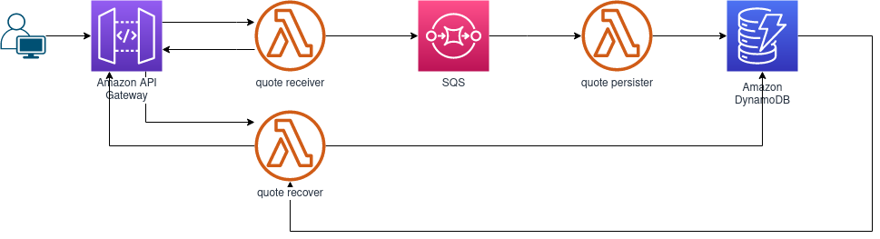

## O que você vai ver nesse artigo
1. AWS services: apigateway, lambda, dynamodb
1. Localstack Community
1. NodeJs
1. Docker compose
1. Terraform

## O que vamos fazer
### Repositório
Todo esse projeto está disponível neste [repositório](https://github.com/leandrostl/localstack-terraform-tutorial).
### Diagrama

### **Configurando o ambiente:**
Estou usando uma máquina rodando ubuntu:
```bash
    leandro@leandro-desktop ~> lsb_release -a
    No LSB modules are available.
    Distributor ID:	Ubuntu
    Description:	Ubuntu 20.04.3 LTS
    Release:	20.04
    Codename:	focal
```

#### **Docker**
Vamos começar instalando o docker. Segui precisamente a [documentação](https://docs.docker.com/engine/install/ubuntu/) da página oficial para instalação no ubuntu. A versão que tenho instalada nesse momento é a:

```bash
    leandro@leandro-desktop ~> docker -v
    Docker version 20.10.12, build e91ed57
```
#### **Docker Compose**
Docker compose foi um pouco mais complicado a instalação. A página do docker aponta para um compose numa versão bem antiga. Preferi entrar no [repositório do github](https://github.com/docker/compose/releases) para verificar e alterar o endereço no comando fornecido na página do Docker. Desta forma segui os passos:
1. `sudo curl -L "https://github.com/docker/compose/releases/download/v2.2.3/docker-compose-$(uname -s)-$(uname -m)" -o /usr/local/bin/docker-compose`
1. `sudo chmod +x /usr/local/bin/docker-compose`

Nesse momento a versão que tenho do docker-compose instalada é:

```bash
    leandro@leandro-desktop ~> docker-compose -v
    Docker Compose version v2.2.3
```

#### **Python**
A *localstack* utiliza o python para rodar. Assim precisei instalar o compilador python e o gerenciador de pacotes no meu ambiente. Segui a [documentação oficial](https://python.org.br/instalacao-linux/). Instalei as seguintes versões:
```bash
   leandro@leandro-desktop:~$ python3 --version
   Python 3.8.10
   leandro@leandro-desktop:~$ pip --version
   pip 20.0.2 from /usr/lib/python3/dist-packages/pip (python 3.8)
```

#### **AWS CLI**
Para rodar comandos no terminal para acesso aos dados de serviços da AWS, mesmo que na localstack, é necessário usar o *AWS CLI*. Para sua instalação, segui o passo a passo informado na [página oficial](https://docs.aws.amazon.com/cli/latest/userguide/getting-started-install.html). Verificando a versão, obtive:

```bash
leandro@leandro-desktop ~/W/R/localstack-terraform-tutorial (main)> aws --version
aws-cli/2.4.11 Python/3.8.8 Linux/5.4.0-94-generic exe/x86_64.ubuntu.20 prompt/off
```

#### **Localstack**
Para instalar o localstack eu tentei seguir o repositório oficial que dizia que não deveria ser instalado usando *sudo*, mas não funcionou. Instalei com o seguinte comando:
```bash
   sudo python3 -m pip install localstack
```
e a versão que tenho instalada é:
```bash
leandro@leandro-desktop:~$ localstack --version
0.13.3.1
```
Também instalei o awscli-local com o comando `pip install awscli-local`. 

#### **Terraform**
O Terraform é uma ferramenta de código de infraestrutura ou, *infrastructure as a code*. É open-source e mantido pela HashCorp. Para instalar, segui a [orientação oficial](https://www.terraform.io/downloads). Depois de instalado, testei a versão para:

```bash
leandro@leandro-desktop:~$ terraform -v
Terraform v1.1.3
on linux_amd64
```

#### **NodeJs**
A escolha de *NodeJs* para esse tutorial foi bastante concorrida com *Python*. Mas pesou o conhecimento e a reutilização do *JavaScrip* em frontends. Aqui vai uma [análise bem interessante](https://dashbird.io/blog/most-efficient-lambda-language/) sobre as possíveis linguagens para desenvolvimento para *AWS Lambdas*.

Para instalar o Node no meu ambiente eu optei por usar o [NVM, gerenciador de versão do node](https://nodejs.org/en/download/package-manager/#nvm). Esse gerenciador pode ser baixado do [repositório oficial](https://github.com/nvm-sh/nvm#install--update-script). Depois de instalado o NVM, basta seguir o [comando descrito no repositório](https://github.com/nvm-sh/nvm#usage).

Com isso a versão do noje na minha máquina ficou:
```bash
leandro@leandro-desktop:~$ node -v
v16.13.2
leandro@leandro-desktop:~$ npm -v
8.1.2
```

## AWS Cloud
Escolhi abordar os seguintes serviços da AWS:
* [API Gateway](https://docs.aws.amazon.com/cli/latest/reference/apigateway/index.html): Permite criar endpoints e associa-los a um backend.
* [Cloudwatch](https://awscli.amazonaws.com/v2/documentation/api/latest/reference/cloudwatch/index.html?highlight=cloudwatch): Permite monitorar a aplicação com alarmes e logs.
* [lambda](https://awscli.amazonaws.com/v2/documentation/api/latest/reference/lambda/index.html): Permite executar uma função sem a necessidade de provisionar ou gerenciar um servidor.
* [DynamoDB](https://awscli.amazonaws.com/v2/documentation/api/latest/reference/dynamodb/index.html): Banco de dados não relacional, *NoSQL*, da AWS.
* [sqs - Simple Queue Service](https://awscli.amazonaws.com/v2/documentation/api/latest/reference/sqs/index.html): Como o nome bem informa, é um serviço de filas de mensagens.

A escolhas são baseadas em necessidades pessoais e naquilo que a localstack oferece gratuitamente.

## Localstack
Para iniciar nosso projeto, é necessário subir a localstack em um container com as configurações adequadas para o ele. Para isso usei o docker compose. Seguindo a [página oficial](https://docs.localstack.cloud/get-started/#docker-compose). Seguindo o que é apresentado na [documentação oficial](https://docs.localstack.cloud/localstack/configuration/), resolvi mudar alguns pontos e meu docker-compose ficou assim:

```yaml
version: "3.8"

services:
  localstack:
    # Determino o nome do container principal da aplicação.
    container_name: ${LOCALSTACK_DOCKER_NAME-localstack-terraform-tutorial}
    image: localstack/localstack
    network_mode: bridge
    ports:
      - "127.0.0.1:4566:4566"
      - "127.0.0.1:4571:4571"
    environment:
      # Como eu resolvi trocar o nome do container principal eu preciso informar em uma
      # variável de ambiente.
      - MAIN_CONTAINER_NAME=${LOCALSTACK_DOCKER_NAME-localstack-terraform-tutorial}
      # Informo os serviços da AWS que desejo usar.
      - SERVICES=${SERVICES-dynamodb,lambda,apigateway,sqs,cloudwatch}
      # Diretório para salvar dados localmente.
      - DATA_DIR=${DATA_DIR-tmp/localstack/data}
      # Como nossas funções lambda serão executadas. Nesse caso escolho o padrão
      # rodar as funções dentro de containers para cada uma.
      - LAMBDA_EXECUTOR=${LAMBDA_EXECUTOR-docker}
      # Esse parâmetro diz respeito a como a função será passada para o container. 
      # Se ela será montada no container ou será copiada. Nesse caso, escolhi copiar
      # todo o arquivo zip para dentro do container.
      - LAMBDA_REMOTE_DOCKER=true
    volumes:
      - "${TMPDIR:-/tmp}/localstack:/tmp/localstack"
      - "/var/run/docker.sock:/var/run/docker.sock"

```

Para rodar o docker-compose, utilizei o comando `docker-compose up`, ele vai subir todo o ambiente. Se quiser continuar a usar o mesmo terminal para outras coisas, adicione o `-d` de *detatch*. Para parar se desfazer de todo o ambiente, basta rodar o `docker-compose down -v`. O `-v` informa que você também quer que os volumes criados sejam excluídos, liberando todos os recursos do computador.

Uma vez em execução é possível verificar se está tudo funcionando corretamente através da url `http://localhost:4566/health`.

## Terraform

Agora vamos prover os serviços e suas configurações através do Terraform, especificando os recursos em arquivos `.tf` que coloquei na pasta `terraform`. 
Seguindo a [documentação do localstack](https://docs.localstack.cloud/integrations/terraform/), primeiro declaramos o `provider "aws"`:

```hcl
provider "aws" {

  access_key = "test"
  secret_key = "test"
  region     = "us-east-1"
  skip_credentials_validation = true
  skip_metadata_api_check     = true
  skip_requesting_account_id  = true

  endpoints {
    apigateway     = var.defaut_endpoint
    cloudwatch     = var.defaut_endpoint
    dynamodb       = var.defaut_endpoint
    iam            = var.defaut_endpoint
    lambda         = var.defaut_endpoint
    sqs            = var.defaut_endpoint
  }
}
``` 

Observe que é necessário apontar os serviços da aws para o LocalStack. Aqui, eu preferi criar uma variável `default_endpoint` para manter o endereço:

```hcl
variable "defaut_endpoint" {
  description = "Endpoint padrão para os serviços AWS local."
  default = "http://localhost:4566"
  type = string
} 
```
#### **API**
A declaração da api, o recurso mensagem e os métodos são bem fáceis de compreender. 
```hcl
# Declarando nossa api para acesso de frases e os métodos
resource "aws_api_gateway_rest_api" "quotes" {
  name        = "Quotes"
  description = "Api para consumo e envio de frases para a aplicação."
}

resource "aws_api_gateway_resource" "quotes" {
  rest_api_id = aws_api_gateway_rest_api.quotes.id
  parent_id   = aws_api_gateway_rest_api.quotes.root_resource_id
  path_part   = "quotes"
}

resource "aws_api_gateway_method" "get_quotes" {
  rest_api_id   = aws_api_gateway_rest_api.quotes.id
  resource_id   = aws_api_gateway_resource.quotes.id
  http_method   = "GET"
  authorization = "NONE"
}

resource "aws_api_gateway_method" "post_quote" {
  rest_api_id   = aws_api_gateway_rest_api.quotes.id
  resource_id   = aws_api_gateway_resource.quotes.id
  http_method   = "POST"
  authorization = "NONE"
}

resource "aws_api_gateway_integration" "quote_receiver" {
  rest_api_id             = aws_api_gateway_rest_api.quotes.id
  resource_id             = aws_api_gateway_resource.quotes.id
  http_method             = aws_api_gateway_method.post_quote.http_method
  integration_http_method = "POST"
  type                    = "AWS_PROXY"
  uri                     = aws_lambda_function.quote_receiver.invoke_arn
}

resource "aws_api_gateway_deployment" "quotes" {
  depends_on = [
    aws_api_gateway_integration.quote_receiver,
  ]

  rest_api_id = aws_api_gateway_rest_api.quotes.id
  stage_name  = "dev"
}
```

Nossa API, portanto, tem um recurso `quote` que é disponível no path de `/quotes` e permite os métodos `POST` e `GET` sem necessidade de qualquer autorização de acesso.

Como vimos em nosso diagrama, o objetivo do projeto é que as frases enviadas sejam enviadas para uma fila por uma função Lambda e depois recuperada por outra função e gravada no banco de dados. Aqui, já declaramos a integração também com a função lambda. Vale Notar:

* `integration_http_method` tem que ser do tipo `POST` para integração com Lambda. Ele informa como a api vai interagir com o backend;
* `type` deve ser, no nosso caso, `AWS_PROXY`. Isso permite que a integração chame um recurso da AWS, no nosso caso a Lambda, e passe a request para a Lambda tratar.

#### **Lambdas**
Para receber a mensagem da API, declaramos no nosso `lambda.tf`:

```hcl
# Lambdas para processar as frases
data "archive_file" "quote_receiver" {
  type        = "zip"
  output_path = "../lambdas/dist/quote_receiver.zip"
  source_dir  = "../lambdas/quote-receiver/"
}

resource "aws_lambda_function" "quote_receiver" {
  function_name    = "quote_receiver"
  filename         = data.archive_file.quote_receiver.output_path
  source_code_hash = data.archive_file.quote_receiver.output_base64sha256
  handler          = "index.handler"
  runtime          = "nodejs14.x"
  role             = "fake_role"
  environment {
    variables = {
      SQS_URL = "${resource.aws_sqs_queue.quotes.url}"
    }
  }
}

``` 

Geramos aqui um arquivo que foi criado na execução do terraform a partir da compactação dos dados dentro da pasta `lambdas/quote-receiver`. O arquivo compactado é referenciado na criação da função. O mesmo ocorre para nossas outras funções, de persistência dos dados e de recuperação.

Um ponto interessante é que é possível passar variáveis de ambiente para a função, como é visto na passagem da variável `SQS_URL`.
#### **Fila SQS**

Declarar a fila também é muito simples:
```hcl
resource "aws_sqs_queue" "quotes" {
    name = "Quotes"
}
```

#### **Dynamo**

O provisionamento de uma tabela nova no dynamo demanda apeans os campos a seguir:

```hcl
resource "aws_dynamodb_table" "quotes" {
    name = "Quotes"
    hash_key = "Author"
    billing_mode = "PAY_PER_REQUEST"
    attribute {
      name = "Author"
      type = "S"
    }
}
```

Observe que eu poderia já informar os demais atributos, mas sou obrigado apenas a informar aquele referente à `hash_key`. 
Esse atributo é equivalente para a AWS ao `partition key`. Caso eu desejasse criar uma `sort key` eu deveria passá-la como 
`range_key` e também informar os dados do atributo.


